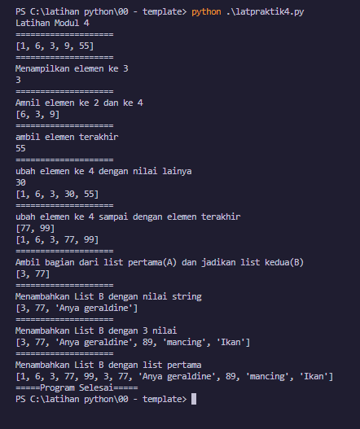
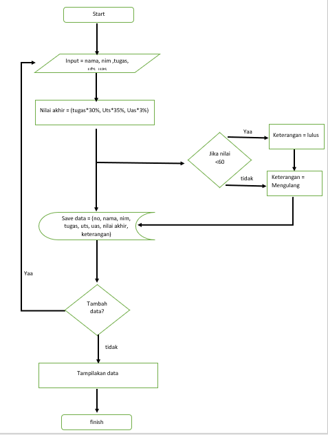

# Belajar list di python
Tugas pertemuan ke-9 Bahasa pemrograman

Nama    : Malik Aziz <br>
kelas   : TI.22.B1<br>
Matkul  : Bahasa Pemrograman<br>


Latihan List pada module ke 4
berikut syntaks nya

```
# MEMBUAT LIST DENGAN 5 ELEMEN BEBAS
print ("Latihan Modul 4")
print (20*"=")
bebas_list = [1,6,3,9,55]
print(bebas_list)
print (20*"=")
print ("Menampilkan elemen ke 3")
print(bebas_list[2])
print (20*"=")
print ("Amnil elemen ke 2 dan ke 4")
print(bebas_list[1:4])
print (20*"=")
print("ambil elemen terakhir")
print (bebas_list[-1])
print (20*"=")
print("ubah elemen ke 4 dengan nilai lainya")
bebas_list [3] = 30
print (bebas_list[3])
print(bebas_list)
print (20*"=")
print("ubah elemen ke 4 sampai dengan elemen terakhir")
bebas_list[3:5] = [77,99]
print(bebas_list[3:5])
print(bebas_list)
print (20*"=")
print("Ambil bagian dari list pertama(A) dan jadikan list kedua(B)")
B_list =[]
B_list = bebas_list[2:4]
print(B_list)
print (20*"=")
print("Menambahkan List B dengan nilai string")
B_list.append ("Anya geraldine")
print(B_list)
print (20*"=")
print("Menambahkan List B dengan 3 nilai")
B_list.extend ([89,"mancing", "Ikan"])
print (B_list)
print (20*"=")
print("Menambahkan List B dengan list pertama")
gabunngan = bebas_list+B_list
print(gabunngan)
print(5*"=" + "Program Selesai" + 5*"=") 
```

Dan berikut adalah hasil output dari syntaks di atas



# Kita masuk pada Tugas untuk membuat list dengan menggunakan Package prettyTable
1. pertama instal dulu package nya dengan syntaks 
   
`` pip install prettytable ``
berikut contohnya


* selanjutnya saya masukan source code nya di bawah ini<br>

```
# instal prettytable
from prettytable import PrettyTable


a = 'Malik Aziz'
b = '312210130'
c = 'TI.22.B1'
d = 'Bahasa Pemrograman'
print("Nama     :", a)
print("Nim      :", b)
print("Kelas    :", c)
print("Matkul   :", d)
print (30*"=")
print("Tugas Praktikum 4")

line=[]
stop=False

while (not stop):
    Nama = input("Masukan Nama: ")
    Nim = input("Masukan Nim: ")
    Tugas = input("Masukan Nilai Tugas: ")
    Uts = input("Masukan Nilai Uts: ")
    Uas = input("Masukan Nilai Uas: ")
    NilaiAkhir = 0.3*float(Tugas) + 0.35*float(Uts) + 0.35*float(Uas)
    if NilaiAkhir < 60 :
        keterangan = " Mengulang ya kawan"
    else:
        keterangan = " lulus cees"
    line.append([Nama, Nim, Tugas, Uts, Uas, NilaiAkhir,keterangan ])


    terusno = input("apakah lanjut?(y/t) ")
    if terusno == "t":
        break


print(30*"=")
a = PrettyTable()
nomer=0

for isi in line:
    nomer +=1
    a.field_names = ["No","Nama","Nim","Tugas","Uts","Uas","Nilai Akhir", "keterangan"]
    a.add_row([nomer, isi[0], isi[1], isi[2],isi[3],isi[4], isi[5], isi[6]])
print(a)

```

* dan inilah outputnya<br>


* Berikut FlowChart nya <br>



Selesai<br>
Terimakasih saya ucapkan
  